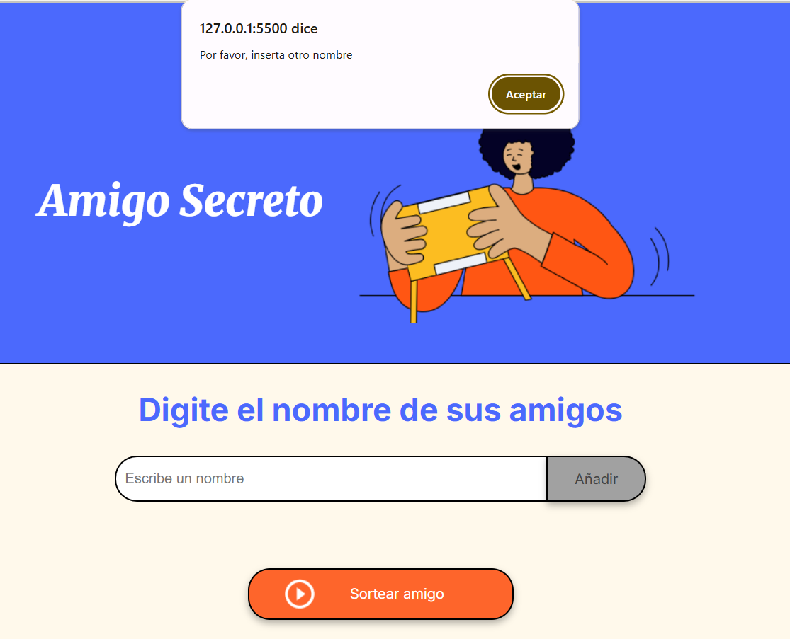
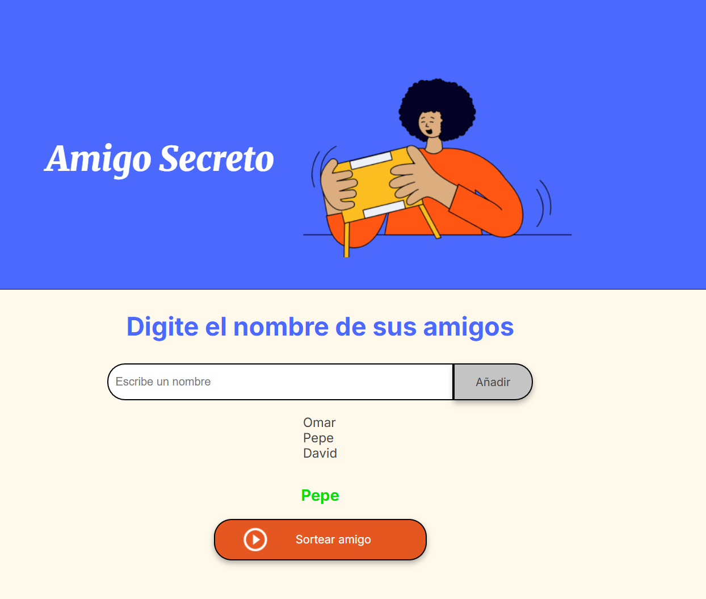

# challenge-amigo-secreto_esp-main
Proyecto del juego de amigo secreto

Este proyecto consiste en desarroollar una palicacion que permita sortear a una persona como amigo secreto, para ello es necesario que  el usuario ingrese los mombres de varios amigos y que la aplicacion los mantenga en memoria para que posteriormente el ususario pesione el botón de sortear y se eleja al azar el nombre de un amigo.
No se puede sejar el campo en  blanco y si se presiona el boton añadir sin haber introcucido el nombe de un amigo, la apliacion deverá indicar que de tiene que ingresar un nombre.

## Funcionalidades de la aplciación
- Agrear nombre de amigos: 
  El usuario debera añadir nombres de amigos, si el campo de texto esta vacio o contiene algun cracter no valido, la apliacion nostrara un mensaje indicandolo.
  

  - Sortear amigo: 
  Una vez ingresados los nombres d elos amigos, proceder a presionarl el boton de sortear
  